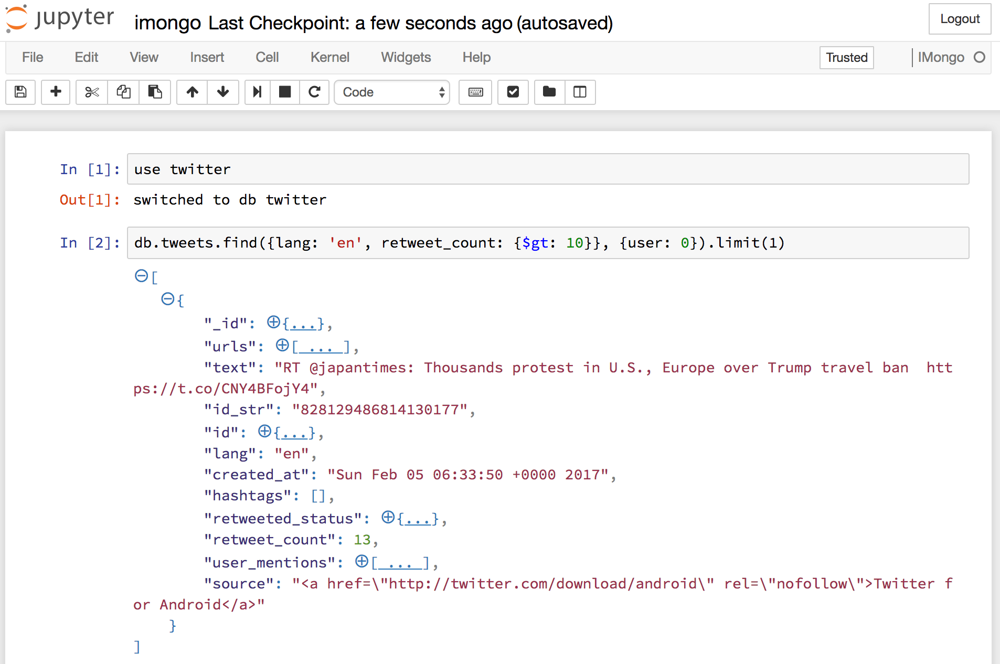

imongo
======

A MongoDB kernel for Jupyter. Mainly for educational purposes.

This kernel wraps the Mongo shell using pexpect_ and was inspired by
`bash_kernel`_ and `ipython_mysql_kernel`_.
It uses Renderjson_ for JSON pretty-printing.

.. _pexpect: https://github.com/pexpect/pexpect
.. _`bash_kernel`: https://github.com/takluyver/bash_kernel
.. _`ipython_mysql_kernel`: https://github.com/mmisono/ipython_mysql_kernel
.. _Renderjson: https://github.com/caldwell/renderjson

   IMongo in action

How to install
--------------

Major requirements
~~~~~~~~~~~~~~~~~~

IMongo requires Jupyter_ and MongoDB_.

.. _Jupyter: http://jupyter.org
.. _MongoDB: https://www.mongodb.com

Install MongoDB
^^^^^^^^^^^^^^^

On macOS, use Homebrew_: ``brew install mongodb``

For other platforms, please refer to the MongoDB documentation_

.. _Homebrew: http://brew.sh/
.. _documentation: https://docs.mongodb.com/manual/installation/

Install Jupyter and IMongo Kernel using ``pip``
^^^^^^^^^^^^^^^^^^^^^^^^^^^^^^^^^^^^^^^^^^^^^^^

To install Jupyter, IMongo and all other dependencies, use ``pip install``:

.. code:: bash

    $ pip install imongo-kernel

Install Jupyter and IMongo Kernel using ``conda``
^^^^^^^^^^^^^^^^^^^^^^^^^^^^^^^^^^^^^^^^^^^^^^^^^

Although the installation with ``pip`` works fine , we recommend using the
``conda`` package manager to create a virtual environment. You need to have
either Anaconda_ or Miniconda_ installed.

.. code:: bash

    $ conda create -n imongo jupyter "python>3.6"
    $ source activate imongo
    $ pip install imongo-kernel

Both methods install the ``imongo`` package and configure Jupyter to be
used with the new kernel by installing a `kernel spec`_.

.. _Anaconda: https://www.anaconda.com/download
.. _Miniconda: https://conda.io/miniconda.html
.. _`kernel spec`: https://jupyter-client.readthedocs.io/en/latest/kernels.html#kernel-specs

Configuration (optional)
^^^^^^^^^^^^^^^^^^^^^^^^
MongoDB configuration such as host/port can be passed as a YAML file,
located at the Jupyter `configuration directory`_.
The default path for UNIX systems is ``~/.jupyter/imongo_config.yml``.
The options available are the same as the ones available for the |mongo|_ CLI tool.
This configuration is necessary in case your MongoDB instance has authentication enabled,
runs at a non-standard port, or runs on a remote (non-localhost) location.

.. _`configuration directory`: http://jupyter.readthedocs.io/en/latest/projects/jupyter-directories.html#configuration-files
.. |mongo| replace:: ``mongo``
.. _mongo: https://docs.mongodb.com/manual/reference/program/mongo

Sample ``imongo_config.yml``:

.. code:: yaml

    host: some.host.io
    port: 27017
    username: username
    password: password
    authenticationDatabase: admin
    quiet: null

If ``imongo_config.yml`` doesn't exist or is empty, IMongo will attempt
to connect to the MongoDB instance at ``localhost:27017``, without any
user authentication.

Uninstall:
----------

.. code:: bash

    # Remove library: 
    $ pip uninstall imongo
    # Remove kernel spec
    $ jupyter kernelspec remove imongo

--------------

TODO:
-----

-  Implement code completion functionality
-  Fix long command issue
-  Send Mongo shell Javascript errors/exceptions to stderr
